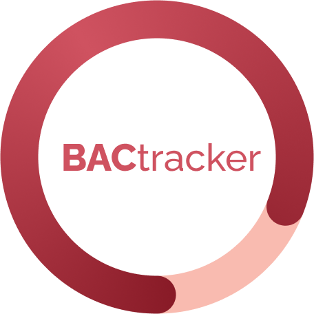

# BACtracker Source Code

This GitHub repository contains the code for our Capstone project. 

## About the Project
Through this project, our group has created and implemented a mobile application that serves as a toolkit on safe alcohol consumption practices for our fellow peers. The app provides a hub of information regarding alcohol consumption, safety practices, and general resources. Using user specific demographics and information, the app can also calculate the BAC (Blood Alcohol Content) of the user as they input the different drinks they have consumed. 
### Additional Links:
- [Final Product](https://bactrackerapp.web.app/)
- [Project Landing Page](https://bactracker-be654.web.app/)
- [Capstone Presentation Deck](https://www.canva.com/design/DAFhnHvY0HM/_0y8v7NEwaUma2l0Glvkgw/view?utm_content=DAFhnHvY0HM&utm_campaign=designshare&utm_medium=link&utm_source=publishsharelink)

## How to Build and Deploy Code
- To access our app on the web, naviagate to [this link](https://bactrackerapp.web.app/).
    - **Recommendation**: For the best viewing experience, open Inspector Tools (in Chrome on a Windows laptop, the shortcut is _Ctrl + Shift + I_ or right click and select 'Inspect') and set the screen dimensions to **iPhone SE**. 
        - If you do this, make sure to **refresh** your screen for the app to refresh window dimensions! However, keep in mind that this may result in a loss of your existing profile personal information, which is a limitation of making our app publicly available by publishing it to the web. 
- Alternatively, to run our code on your own laptop, please clone our repository by using the command `git clone`. 
- In your IDE, open a new terminal. To install all of the code packages, type and enter the command `npm install`. 
    - Occassionally, you may run into errors. If you do, try `npm install --force` to get these packages installed.
- To run our app, type and enter the command `npm run web`. This will open our app in your browser via localhost. 
    - Due to the implementation being done from a mobile-first approach, we suggest viewing this app in a phone-type view. To best replicate this, we have set our app size to be the width of a iPhone SE (375 pixels). However, due to limitations technically, we are unable to set our app's height to a hard value. This will differ depending on the device you are on. 
    - Follow the **screen size recommendation** detailed above for the best viewing experience.
    
If you have any questions or run into any issues, please feel free to contact any members of our team! Our team email is: TeamiBant@gmail.com

## How to Contribute to Code
If you would like to build upon our open-source project and contribute to our code repository, please read through each of our README files (listed above) to fully familiarize yourself with our project. Then send an email to TeamiBant@gmail.com introducing yourself and proposing how you would like to contribute to the project. Please include your contact information and GitHub profile in this email, and we will be in touch with you about next steps!

## About the GitHub
Below, we describe the main files in this app. Each directory includes it's own README file that further describes its contents.  
| File name | Contents | 
|-----------|----------|
| [App.js](./App.js) | Serves as the home file of the app. Holds imports to all pages and necessary assets (ie. fonts) |
| [License File](./LICENSE) | Outlines copyright and other software permissions of our project.  |
| [Assets Directory](./assets/) | Contains more specific directories that contain visual elements and other assets used in our application |
| [Components Directory](./components/) | Contains shared components used across different screens and pages (such as modules and reusable parts) |
| [JSON Directory](./json/) | Contains JSON files containing data used to create pages, provide information and calculate BAC |
| [Screens Directory](./screens/) | Contains JavaScript files of all individual unique screens of our app |
| [app.json](./app.json) | Includes backend information about app, including React Native properties used when running app |
| [package-lock.json](./package-lock.json) and [package.json](./package.json) | Describe different versions of and names of packages/dependencies used to create this app |

## About Us

Hi there! We are Team Trackers, a group of five informatics students continuing the work of the capstone group iBant. Our aim is to help people who struggle with unhealthy drinking habits, such as emotional drinking, mixed drinking, and insufficient self-care after drinking. We have introduced several new features from the previous version, including an emotional state slider, age input, mixology information, self-care resources, emergency contact options, and notification settings. We hope you enjoy exploring the app!🥰

### Project Contact Information
Team iBant email: TeamiBant@gmail.com
 
Jessi Zeng: xuemiz@uw.edu
 
Sid Zhang: junhaz2@uw.edu
 
Junna Cao: jnana@uw.edu
 
Niyat Efrem: niyate@uw.edu
 
Pooja Thorali: thoralip@uw.edu

<!-- 

    

 -->
